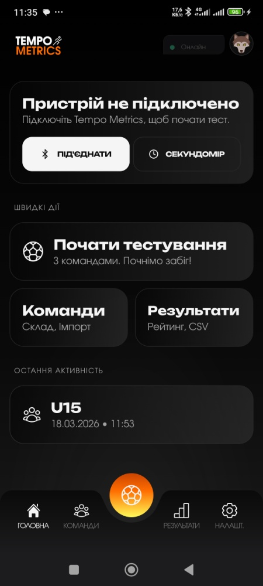
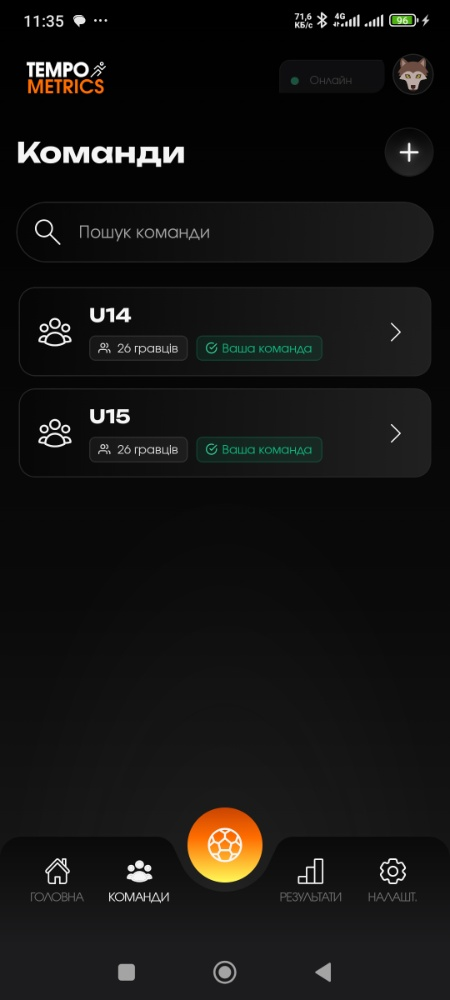
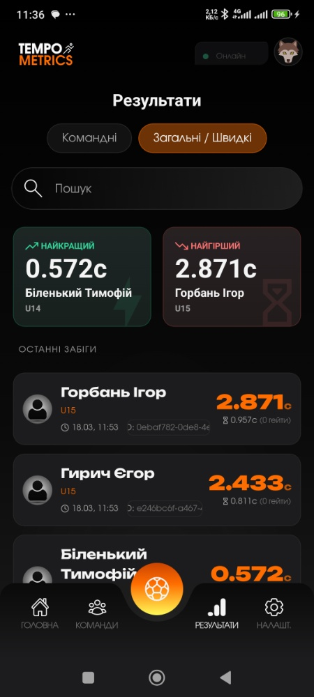
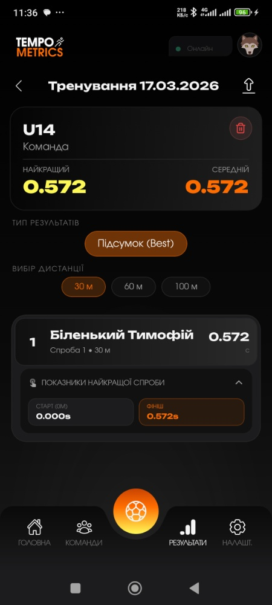
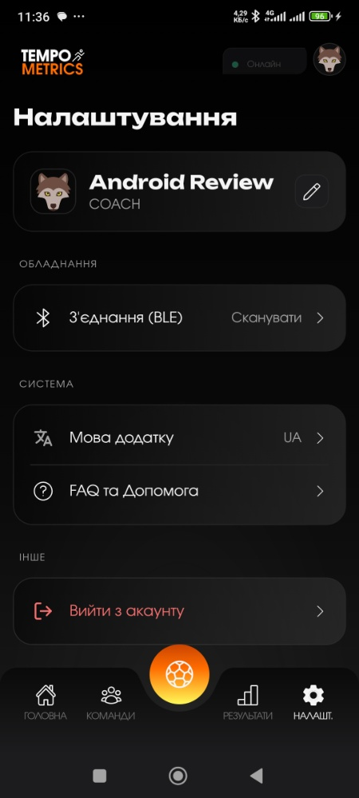

<div align="center">
 

# Tempo Metrics


**Сучасний крос-платформний мобільний застосунок для проведення спортивних тестувань, відстеження результатів та аналітики показників спортсменів.**

_Розроблено за підтримки Innovation HUB (наукової лабораторії ДУ «Житомирська політехніка») та футбольного клубу «Полісся»._
 
© 2026 Tempo Metrics. All rights reserved.
Developed and architected by Tsimbalyuck Ruslan.
</div>

<br>

## Стек технологій

* **Frontend:** React Native, TypeScript
* **Styling:** Tailwind CSS
* **Backend / Database:** Supabase (PostgreSQL)

## Основні можливості (Features)

### Взаємодія з обладнанням
* Підключення до сенсорів по Bluetooth.
* Гнучка ініціалізація сенсорів у будь-якому порядку.
* Підтримка конфігурацій систем на 2 або 3 гейти (ворітця).
* Вбудований точний секундомір.

### Режими тестування
* **Швидке тестування:** Можливість провести замір у режимі "Гість" без попередньої реєстрації команди.
* **Командне тестування:** Повноцінний режим для фіксації результатів цілої команди.

### Управління даними та гравцями
* Гнучке створення команд.
* Масове завантаження списків гравців через `.csv` та `.xlsx` (Excel) файли, а також можливість ручного додавання.
* Надійна система авторизації з підтвердженням реєстрації через Email (на базі Supabase).

### Аналітика та експорт
* Система рейтингів: перегляд результатів конкретної команди або загальна статистика у вигляді сесій.
* Експорт даних: зручна система вивантаження результатів тестувань у зрозумілі табличні формати для подальшого аналізу тренерами.

### Інше
* **Локалізація:** Повна підтримка української та англійської мов.

---

## Локальне розгортання

Для того, щоб запустити проєкт локально, виконайте наступні кроки:

1. Встановіть усі необхідні залежності:
   ```bash
   npm install
2. Запустіть локальний сервер розробки Expo:
    ```bash
    npx expo start

### Скрипти збірки (Builds)
У проекті налаштовані зручні команди для генерації різних версій Expo:
* Створення Preview версії:
    ```bash
    npm run build:prev```
* Створення Developer версії:
    ```bash
    npm run build:dev``` 
* Послідовна збірка обох версій (спочатку Dev, потім Prev):
    ```bash
  npm run build:both
  
---
Розроблено для покращення спортивних результатів та автоматизації процесів тестування.
## Конфігурація середовища (.env)

Для коректної роботи застосунку з базою даних та бекендом необхідно налаштувати змінні середовища.

1. Створіть файл `.env` у кореневій папці проєкту.
2. Скопіюйте туди наступні ключі та додайте ваші значення з панелі управління Supabase:

```env
EXPO_PUBLIC_SUPABASE_URL=ваша_url_адреса_supabase
EXPO_PUBLIC_SUPABASE_ANON_KEY=ваш_анонімний_ключ_supabase
```
---
### Для розробників (Архітектура та структура проєкту)
Проєкт побудовано за модульним принципом для зручного масштабування та підтримки. Нижче наведено опис основних директорій:
<pre>
Tempo_Metrics
 ┣ assets/             # Статичні ресурси (шрифти, іконки, логотипи InHub та Полісся)
 ┃ ┣ fonts/            # Кастомні шрифти Figma
 ┃ ┣ icons/            # Іконки застосунку
 ┃ ┗ web/              # Файли для веб-версій / сторінки для email, privacy policy тощо
 ┣ src/                # Головна директорія з вихідним кодом
 ┃ ┣ constants/        # Глобальні константи проєкту
 ┃ ┣ context/          # Глобальні стани React (Context API)
 ┃ ┣ hooks/            # Кастомні React-хуки
 ┃ ┣ lib/              # Конфігурації сторонніх бібліотек (напр., ініціалізація Supabase)
 ┃ ┣ locales/          # Файли локалізації (українська та англійська мови)
 ┃ ┣ services/         # Логіка роботи з базою даних
 ┃ ┣ types/            # Інтерфейси та типи TypeScript
 ┃ ┣ utils/            # Допоміжні утиліти
 ┃ ┗ views/            # UI-компоненти та екрани застосунку з тулзами
 ┣ App.tsx             # Точка входу в застосунок
 ┣ app.config.js       # Конфігурація Expo
 ┣ eas.json            # Конфігурація для EAS Build (хмарна збірка Expo)
 ┣ global.css          # Глобальні стилі (Tailwind / NativeWind)
 ┣ tailwind.config.js  # Налаштування Tailwind CSS
 ┗ package.json        # Залежності та скрипти збірки
</pre>
#### Детальніше про ключові модулі src/:
* ```views```: Тут знаходиться всі візуальний інтерфейс. Усі екрани, дрібні компоненти лежать у цій директорії.
* ```services```: "Серце" взаємодії з БД. Відповідає за CRUD-операції з Базою даних.
* ```lib``` та ```context```: Відповідають за конфігурації бібліотек та глобальними змінами.
* ```locales```: Директорія локалізації застосунку. Поділений на EN та UK.
* ```hooks```: Бізнес-логіка застосунку. Кожен хук відповідає своєму Тулзу або Екрану.

---
### Скріншоти (Screenshots)

<div align="center">
  
  
  
  
  
  
  
  
</div>